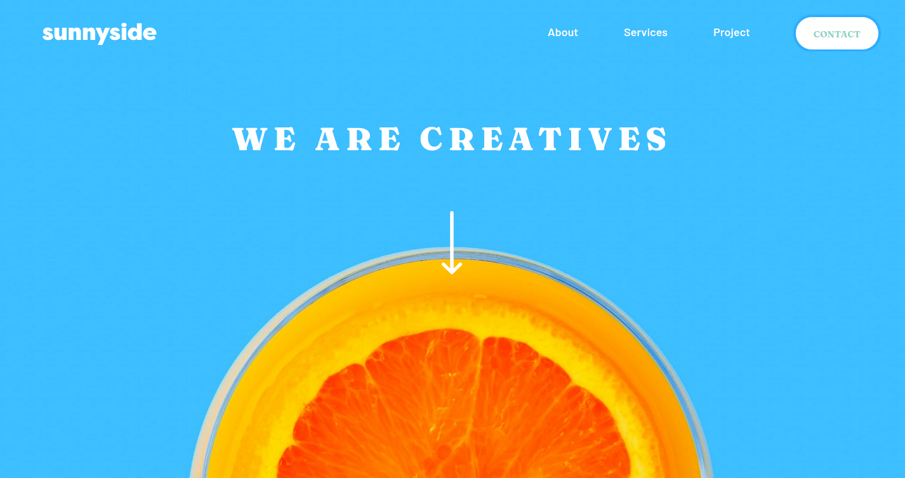

# Frontend Mentor - Sunnyside agency landing page solution

This is a solution to the [Sunnyside agency landing page challenge on Frontend Mentor](https://www.frontendmentor.io/challenges/sunnyside-agency-landing-page-7yVs3B6ef). Frontend Mentor challenges help you improve your coding skills by building realistic projects.

## Table of contents

- [Overview](#overview)
  - [The challenge](#the-challenge)
  - [Screenshot](#screenshot)
  - [Links](#links)
- [My process](#my-process)
  - [Built with](#built-with)
  - [What I learned](#what-i-learned)
  - [Continued development](#continued-development)
  - [Useful resources](#useful-resources)
- [Author](#author)

**Note: Delete this note and update the table of contents based on what sections you keep.**

## Overview

### The challenge

Users should be able to:

- View the optimal layout for the site depending on their device's screen size
- See hover states for all interactive elements on the page

### Screenshot

### Links

- Solution URL: [Repository](https://github.com/jglopezre/bootstraped-html-home-page.git)
- Live Site URL: [Live](https://jglopezre.github.io/bootstraped-html-home-page/)

## My process

### Built with

- Semantic HTML5 markup
- [SASS Lang](https://sass-lang.com/) - For CSS Style
- [Bootstrap 4.16](https://getbootstrap.com/docs/4.6/getting-started/introduction/)
- [Owl-Carousel 2](https://owlcarousel2.github.io/OwlCarousel2/) - For images and picture collection showing

### What I learned

I took permission about make a change on original design improving pictures showing. I added a carousel, This allow users to drag pictures, and shows automatically pictures. This improvement allow designers to add more pictures in the same space, and show it in sequency. Owl-Carousel 2 library allow designer to add severals carousel in the same page.

### Continued development

For now, my intention are focused on improve skills using Bootstrap.

### Useful resources

- [W3School](https://www.w3schools.com/default.asp) - Information about HTML, CSS, JavasCript and more

## Author

- Website - [Javier Lopez](http://javierlo.site/)
- Frontend Mentor - [@jglopezre](https://www.frontendmentor.io/profile/jglopezre)
